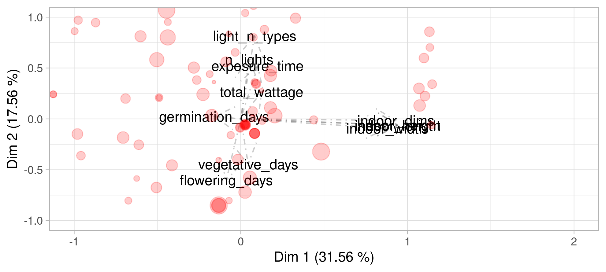
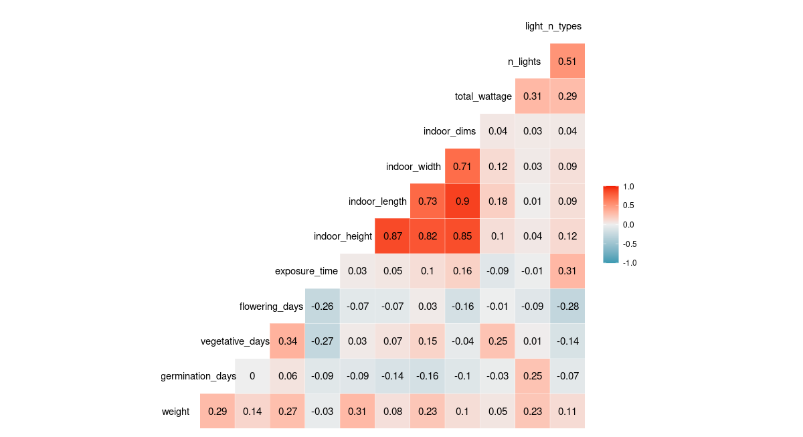

Data Science Tips for Improving Your Cannabis Yields
================
Cannabis Data Science Group, by Juan Cruz Rodriguez
3/30/2021

[**Grow with Jane**](https://growithjane.com/) is the mobile application
that provides cannabis growers with the necessary tools to take maximum
care of their plants. Jane results in a Swiss army knife for the home
cannabis grower, providing tools from calculators and charts to logging
and tracking. Jane’s users log events related to each plant, and once
they harvest, the grow log can be shared on Jane’s social network,
allowing knowledge to be shared in the community.

Thanks to these [publicly shared cultivation
records](https://growithjane.com/explore-growlogs), from a data science
approach, we are able to explore and analyze different patterns that
optimize the yields of cannabis growth, towards the definition of
cultivation recommendations to improve the resulting product.

To provide these growth recommendations, we analyzed a data set of 127
logs. The main objective of the study was to analyze the variability -to
maximize- the resulting `weight` of the product -flowers-. To maximize
the total flower `weight` of each plant, we analyze the effect of the
variables:

-   `breeder_name`: The name of the seed breeder company.
-   `strain`: The name of the strain variety.
-   `env`: Whether grown indoors or outdoors.
-   `strain.type`: Either automatic, feminized, or regular.
-   `strain.strainClass`: Be it Indica, Sativa, or hybrid.
-   `tree_medium`: The medium in which it was grown, one of coconut,
    hydro, or soil.
-   `germination_days`: Days that it was in the germination stage.
-   `vegetative_days`: Days that it was in the vegetative stage.
-   `flowering_days`: Days that it was in the flowering stage.
-   `exposure_time`: Daily exposure time.
-   `indoor_height`: The height of the indoor (if it is indoor).
-   `indoor_length`: The length of the indoor (if it is indoor).
-   `indoor_width`: The width of the indoor (if it is indoor).
-   `indoor_dims`: The dimensions of the indoor (height \* length \*
    width).
-   `n_lights`: The number of lights it had.
-   `total_wattage`: The sum of the wattage of the lights.
-   `light_n_types`: The number of different types of light it had.

Before we begin, we present our variable of interest, the `weight`
resulting from growth. In our data set, we found a minimum of 4.8 grams,
an average of 86.13, and a maximum of 399.59 grams. Remember that this
data is kindly provided by Jane users, so we may need a thorough cleanup
of erroneous data. Let’s start with the analysis of the effect of
dependent variables on `weight`.

*Note:* The idea of this post is to make it understandable to anyone,
regardless of their background. That is why we will try to minimize
technical details as much as possible. However, do not panic if
something confuses you, it is not essential to understand the techniques
or what is pointed out, but it is convenient to follow the thread of the
project.

## Principal Component Analysis

Principal Component Analysis (PCA) is a statistical technique that
attempts to map a large number of dependent variables to a smaller
number of variables that explain the same observed effects. With the PCA
we have not been able to obtain “such good” results statistically
speaking since only 49% of the total variability is explained between
the first two components. Furthermore, as shown in the figure, we can
not easily observe an agglomeration of large or small dots (high/low
gram production), which would indicate that some components would
significantly influence the produced grams. However, it should be noted
that the first component (it explains 31.56%) is mainly influenced by
variables related to the size of the indoor. While in the second
component, what most influences are, on the one hand, the variables
related to the lights and the time of exposure to them, and on the other
hand, the variables related to the time in the vegetative and flowering
states.

Principal component analysis. Each dot indicates a growth log. Larger
dots indicate more total grams obtained. Dots near each label indicate a
greater relationship of the point to those variables.

## Correlations Analysis of Numerical Variables

Now, let’s move on to analyzing the correlations between our variable of
interest `weight` and the various individual dependent variables. The
correlation between two features is a value between -1 and 1, which
indicates whether two variables are positively or negatively correlated,
for instance, a correlation value of -1 would be when one variable
increases the other decreases in the same proportion. On the other hand,
values close to 0 indicate that there is no correlation.

To read the following diagram, what we do is select two variables of
interest, one in a row and one in a column, and detect the cell at the
intersection, that value is the correlation between them. In the graph
below, to check for multiple correlations, we kept all variables
present, that is, all pairwise correlations. For the interest of our
project, we should focus mainly on the last row, which shows the
correlations of the different variables vs `weight`. Although there is
not a variable that shows a great individual correlation with the
`weight`, it is interesting to note that the variables
`germination_days` and `flowering_days` show a correlation of 0.29 and
0.27 respectively, `indoor_height` and `indoor_width` present 0.31 and
0.23, and `n_lights` has a value of 0.23, which shows that, as is known,
the total product `weight` is influenced by time at each stage, the size
of the cultivation area and the lighting.

Correlation analysis of numerical variables. A correlation value close
to 1 (-1) will indicate a direct (inverse) relationship between two
variables, meanwhile, a value close to 0 indicates no correlation.

## Categorical Variables Analysis

Let’s now turn to the analysis of the effect of categorical variables on
the `weight`. To detect the categorical variables that influence the
`weight` produced, the statistical technique of ANalysis Of VAriance
(ANOVA) was used. For each variable of interest, the ANOVA will return a
statistical value, known as *p-value*, which denotes whether there is a
significant relationship between the variable and `weight`. Then, given
a cut-off value for the p-value, it is established whether the variable
resulted statistically significant or not.

| Variable           | p-value | Significant at 0.1 |
|:-------------------|--------:|:-------------------|
| breeder\_name      |   0.006 | TRUE               |
| strain.type        |   0.092 | TRUE               |
| strain.strainClass |   0.475 | FALSE              |
| strain             |   0.561 | FALSE              |
| env                |   0.612 | FALSE              |
| tree\_medium       |   0.752 | FALSE              |

Results of the analysis of variance between the `weight` and the rest of
the categorical variables. P-value significance cutoff level set at 0.1.
A significant variable denotes that its effect influences the `weight`
variable.

As we can see in the table above, at a cut-off level of 0.1, the
variables `breeder_name` and `strain.type` resulted as statistically
significant. Let’s analyze the top-5 categories of each variable that
result in the highest `weight` values -*to detect which pairwise
category contrasts are statistically different, it is suggested to carry
out a Tukey’s Test*-.

As seen below, the top categories in production grams result as
“T.H.Seeds ™” for the breeder, “Garlic Crumpet” as the top strain,
regular strain type, and Sativa for strain class. For the rest of the
variables, we could not observe a “big” difference in terms of the
resulting `weight` (*Tukey’s Test should be performed*).

| breeder\_name     | Logs | Mean weight | Median weight |
|:------------------|-----:|------------:|--------------:|
| th seeds          |    3 |      128.00 |        117.00 |
| seedsman          |   13 |       99.52 |        100.00 |
| barneys farm      |    9 |       75.51 |         82.00 |
| mephisto genetics |    4 |       74.38 |         63.25 |
| kannabia seeds    |    3 |       71.33 |         90.00 |

| strain         | Logs | Mean weight | Median weight |
|:---------------|-----:|------------:|--------------:|
| garlic crumpet |    3 |      289.18 |        257.14 |
| white widow    |    7 |       98.66 |         72.00 |
| durban poison  |    3 |       88.63 |         58.40 |
| gelat.og       |    4 |       85.80 |         88.50 |
| bam bam        |    3 |       50.67 |         41.00 |

| strain.type | Logs | Mean weight | Median weight |
|:------------|-----:|------------:|--------------:|
| regular     |    8 |      138.62 |          85.2 |
| Feminized   |   11 |      109.17 |          75.6 |
| automatic   |   20 |       57.93 |          56.0 |

| strain.strainClass | Logs | Mean weight | Median weight |
|:-------------------|-----:|------------:|--------------:|
| sativa             |    3 |      128.00 |          12.5 |
| hybrid             |   31 |       92.10 |          56.0 |
| indica             |    5 |       45.88 |          22.4 |

| tree\_medium | Logs | Mean weight | Median weight |
|:-------------|-----:|------------:|--------------:|
| coco         |   16 |       90.70 |          52.0 |
| hydro        |   18 |       82.67 |          74.5 |
| soil         |   71 |       75.70 |          56.0 |

| env     | Logs | Mean weight | Median weight |
|:--------|-----:|------------:|--------------:|
| indoor  |  119 |       87.08 |          59.0 |
| outdoor |    8 |       72.08 |          72.8 |

## Conclusions

Although we had “few” data samples to analyze (127 logs; with many
different categories), in the present work we were able to detect
different variables that influence the resulting crop production. We
confirmed that variables related to time in each growth stage, the size
of the growing area, and the various sources of lighting significantly
influence the grams of production. On the other hand, we provided tips
for the moment to plan our cultivation, regarding the selection of
breeder and strain, among others, that provide better results.
Undoubtedly, with a greater amount of data, statistically speaking, more
robust recommendations could be provided for both home and large-scale
cultivation.

## Next Steps

As the next steps, it would be important to get more data, and in turn,
also focus on cleaning up possibly bad data.

On the other hand, as an immediate next step, we are currently working
on the second part of this blog post, where we apply Machine Learning
models to predict the grams of production. Using Machine Learning it is
possible to evaluate different models in order to detect the one that
best fits. Once the best model is detected, it can be used to obtain the
expected number of grams for a selected combination of dependent
variables. Towards, a tool to interactively simulate different growing
environments to maximize cannabis yields.

## Reproducibility

All the work presented in this post can be easily replicated. The full
code is available on
[GitHub](https://github.com/jcrodriguez1989/growerdsbuddy/).

## Acknowledgments

I thank [Jorge Claudio Vargas
Rojas](https://vinv.ucr.ac.cr/sigpro/web/researchers/206330512) for the
discussion and design with respect to this project.
